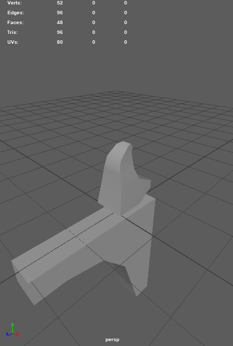

# CIS 566 Project 5: Shape Grammar

* Name: Linshen Xiao
* PennKey: Linshen
* Tested on: Windows 10, Intel(R) Core(TM) i7-6700HQ CPU @ 2.60GHz, 16.0GB, NVIDIA GeForce GTX 970M (Personal computer)

## Demo

- [https://githublsx.github.io/homework-5-shape-grammar-city-githublsx/](https://githublsx.github.io/homework-5-shape-grammar-city-githublsx/);

## Assignment Description

**Goal:** to model an urban environment using a shape grammar

## Assignment Details

### Section Node

The section node class includes following attributes necessary for rendering, such as

- Position;
- Scale;
- Which surface can generate new cube;
- If it is a new generated cube, from which surface;
- If it is the root;
- If it has become a balcony;

### Grammar design

Shape grammar rules:

- If it is a new cube, then random face(*along x, y, or z axis with random possibility*) besides the face that has been occupied by other cubes can generate new cubes(*child geometry*), the new generated cube's position will be decided by the combination of width/depth/height and the translation of the original cube(nearly all following rules *use some property about the geometry's location* to generate new ones) the corresponding opposite surface of the new generated cube can't generate more cubes;
- If it is a cube, then it should have a roof, which is a scaled triangular pillar;
- If it is not a root cube, then it can become a balcony;
- If it is a attached generated cube, then it should have support pillars to the ground;
- If there is a roof, then it should have some extension on ridge and hip;
- If there is a roof, then it should have ridge and decorations on the ridge;
- If the width/depth of the new generated cube plus the width/depth of the original cube is larger some of the bounding box attributes, then just use the minus of bounding box and the width/depth of the original cube as the new width/depth, and this new generated cube can't generate more cubes on this surface;
- After the section's geometry, scaling, translation, rotation and other attributes has been decided, a renderer will interpret the results of the shape grammar parsers and adds the appropriate geometry to the scene for each section.

### Create a city (30 points)
- A ground plane has been added to your scene, its scale is decided by the total scale of the city;
- The base of the city is still grid, But the buildings and trees are distributed procedurally by Perlin noise. I decide the randomness of each grid by its coordinate through [Fractal Brownian Motion function](https://thebookofshaders.com/13/), which is 0 ~ 1. 
    - If the randomness smaller than 1/3, then it should be covered with trees; 
    - If the randomness is larger than 2/3, then it should be covered with higher and larger buildings with more iterations; The size of the building will be decided if its surrounding has been occupied by other large buildings and if it is river or tree.
    - Otherwise, it will be covered with houses with average sizes; This greatly reflects the high-population density distribution. Also, the surrounding of larger buildings will have chances to generate few trees. 
- There are also rivers generated. The river has randomness to go up, left or right; However, if the river go left first, then it can't go right on the next step; Same for the right condition.
- There are also roads across the city, the locations of which are decided by the division of city(for example, 1/3, 2/3)with some random number; When the road meet with the river, it will be replaced by the bridges, which is higher than the river, so it would be necessary to see if the next step will be river to decide the current tile;
- Trees and buildings will not generated on roads and rivers;
- The color of the roof is decided by the height of the buildings, the higher the building, the brighter the color. It may not be clear on the default setting, but you may change the distribution and the colors to have a better visualization.

Still, Instead of drawing individual mesh components one at a time, which will cause the program to render very slowly, I expand lists of vertex information when reading the generated grammar, and push all VBO data to the GPU at once after finished all iteration for drawing.

### OBJ loading
I've enabled my program to import OBJ files and store their information in VBOs. I used an OBJ-loading package via NPM:

[webgl-obj-loader](https://www.npmjs.com/package/webgl-obj-loader)

I read the local test file by using the method via following website:

[How to read a local text file?](https://stackoverflow.com/questions/14446447/how-to-read-a-local-text-file)

### All OBJs

|||||
|--------------|--------------|--------------|--------------|
|||||
|||||

### Others

- I add simple fog based on gl_FragCoord.z / gl_FragCoord.w in fragment shader;
- Most of the objs are created by myself, except a [low poly tree model](https://free3d.com/3d-model/low-poly-tree-v1-146606.html).

### Interactivity

I use dat.GUI to make lots of aspects of the demo an interactive variable, including:

* totalnumber: the scale of the city
* minroof: transition of roof's color
* fogdensity: density of the fog
* Color: colors of different components
* Load: Remember to press Load to regenerate the tree after modifying the totalnumber!

### More screenshots

Every time you hit 'Generate' you will get a random city:

## Resources

- [webgl-obj-loader](https://www.npmjs.com/package/webgl-obj-loader)
- [How to read a local text file?](https://stackoverflow.com/questions/14446447/how-to-read-a-local-text-file)
- [Houdini Procedural Lake Houses](https://vimeo.com/195580569)
- [Low Poly Tree](https://free3d.com/3d-model/low-poly-tree-v1-146606.html)
- [Fractal Brownian Motion](https://thebookofshaders.com/13/)
